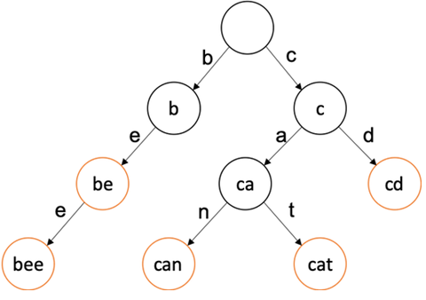

# XV6 AutoCorrect multithreading

## Introduction
Project from RAF (School of Computing). The goal of the assignment is to write a C program for a Linux system that provides the user with autocomplete functionality. The user inputs an arbitrary prefix, and the screen displays words that start with that prefix. Potential words are read from text files. Words in memory should be stored in a trie structure, which should support concurrent insertion of words as well as concurrent search.

## User Interaction

The user can issue commands to the system via the command line. The following commands should be supported:
<ul>
  <li>_add_ <dir></li>
  <li>_stop_</li>
</ul>

The _add_ command adds a new directory containing text files to the system. When this command is executed, a new scanner thread should be created to scan that directory. The directory name is provided without the trailing slash.

The _stop_ command shuts down the application.

If the user types anything else into the console and presses enter, it is assumed that the last word entered on that line is the prefix for which the user wants to get autocomplete results. If the user enters more than one word on the same line, any words before the last one are ignored. The screen should immediately display all words found so far that start with the given prefix. If the search is still ongoing and a new word that starts with that prefix is found, it should be displayed on the screen. The user cannot enter new commands while these words are being displayed. The user ends the current search by pressing the CTRL+D key combination. After pressing CTRL+D, the output stops, and the user can enter a new command or prefix for the search.

## Scanner Thread

Each scanner thread traverses its directory and reads words from it. The thread should ignore any subdirectories and read all files, assuming they contain plain ASCII-encoded text. This thread needs to keep track of which files it has already read, as well as when those files were last modified, using a shared array that contains a list of all scanned files so far, along with their last modification times.

When the thread encounters a file that it has not read before, or a file that has been modified since the last read, it starts reading. The thread reads word by word from the file. Words are separated by SPACE (' '), TAB ('\t'), or ENTER ('\n') characters. If a word contains any characters other than uppercase or lowercase letters of the English alphabet, the entire word should be ignored. Words will have a maximum length of 63 characters. For words longer than this, only the first 63 characters should be retained. Once a word is read, all uppercase letters should be converted to lowercase. The processed word is then inserted into the trie structure, which is shared among all scanner threads.

When the thread finishes scanning its designated directory, it pauses for five seconds before starting to traverse the entire directory again. During this new traversal, only new and modified files will be read. The thread should perform this task in an infinite loop. This means that the system should detect and react to the addition of new files and the modification of existing files.

## Trie Structure

A trie (or prefix tree) is a structure where each of its nodes contains:
<ul>
  <li>A letter <dir></li>
  <li>Up to 26 pointers to child nodes</li>
  <li>A pointer to the parent node</li>
  <li>A flag indicating the end of a word</li>
  <li>A count of sub-words, not including itself</li>
</ul>
The root of the structure is typically empty. A word in the trie structure is represented as a sequence of nodes from the root to a leaf, where each subsequent node in the path represents one letter of the word. The following image illustrates a trie containing the words: "be," "bee," "can," "cat," and "cd."

  

